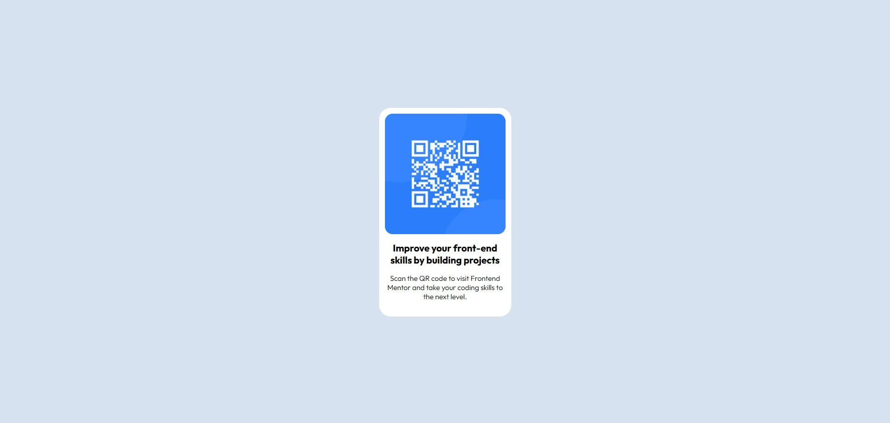

# Frontend Mentor - QR code component solution

This is a solution to the [QR code component challenge on Frontend Mentor](https://www.frontendmentor.io/challenges/qr-code-component-iux_sIO_H). Frontend Mentor challenges help you improve your coding skills by building realistic projects. 

## Table of contents

- [Overview](#overview)
  - [Screenshot](#screenshot)
  - [Links](#links)
- [My process](#my-process)
  - [Built with](#built-with)
  - [What I learned](#what-i-learned)
- [Author](#author)

**Note: Delete this note and update the table of contents based on what sections you keep.**

## Overview

### Screenshot

### Links

- Solution URL: [Add solution URL here](https://github.com/ShaneGHB/qr-code-component-main.git)
- Live Site URL: [Add live site URL here](https://shaneghb.github.io/qr-code-component-main/)

## My process

### Built with

- Semantic HTML5 markup
- CSS custom properties
- Flexbox
- Mobile-first workflow

### What I learned

Working on this project taught me a lot, not just about the technical side of things, but also about how to stay focused and problem-solve when things don’t go as planned. One of the biggest challenges I ran into was dealing with errors i didn’t expect—especially when handling data and trying to get certain features to work properly,understanding of core development principles such as clean code, modular design, and version control. There were moments where I felt stuck, but digging into documentation, trying different approaches worked out well.

## Author

- Frontend Mentor - [@ShaneGHB](https://www.frontendmentor.io/profile/ShaneGHB)

